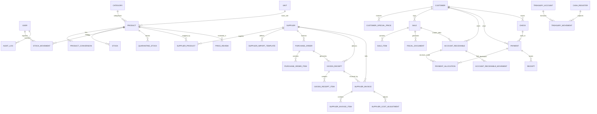

# Modelo de Dominio — Sistema de Gestión ERP para Distribuidora Médica

**Versión:** 1.0  
**Estado:** Definición Técnica de Entidades y Relaciones  
**Propósito:** Servir de especificación formal para el diseño de la Base de Datos (PostgreSQL/Prisma/TypeORM) y la capa de servicios del Backend.

---

## 1. Diagrama Entidad-Relación de Dominio



---

## 2. Enumeraciones y Tipos del Dominio

```typescript
export enum Role {
  VENDEDOR = 'VENDEDOR',
  ADMINISTRADOR = 'ADMINISTRADOR',
}

export enum StockMovementType {
  ENTRADA_COMPRA = 'ENTRADA_COMPRA',
  SALIDA_VENTA = 'SALIDA_VENTA',
  MERMA = 'MERMA',
  AJUSTE_ENTRADA = 'AJUSTE_ENTRADA',
  AJUSTE_SALIDA = 'AJUSTE_SALIDA',
  DEVOLUCION_CLIENTE = 'DEVOLUCION_CLIENTE',
}

export enum QuarantineStatus {
  EN_CUARENTENA = 'EN_CUARENTENA',
  MERMA_CONFIRMADA = 'MERMA_CONFIRMADA',
  DEVOLUCION_PROVEEDOR = 'DEVOLUCION_PROVEEDOR',
  REINGRESADO_STOCK = 'REINGRESADO_STOCK',
}

export enum PurchaseOrderStatus {
  BORRADOR = 'BORRADOR',
  EMITIDA = 'EMITIDA',
  PARCIAL = 'PARCIAL',
  COMPLETADA = 'COMPLETADA',
  CANCELADA = 'CANCELADA',
}

export enum SupplierInvoiceStatus {
  BORRADOR = 'BORRADOR',
  VALIDANDO = 'VALIDANDO',
  OBSERVADA = 'OBSERVADA', // Tolerance breach or qty mismatch
  AUTORIZADA = 'AUTORIZADA', // Approved by Admin
  CONFIRMADA = 'CONFIRMADA', // Posted to Cta Cte
}

export enum PriceReviewStatus {
  PENDIENTE = 'PENDIENTE',
  APROBADO = 'APROBADO',
  RECHAZADO = 'RECHAZADO',
  POSPUESTO = 'POSPUESTO',
}

export enum SaleStatus {
  BORRADOR = 'BORRADOR',
  CONFIRMADA = 'CONFIRMADA',
  CANCELADA = 'CANCELADA',
}

export enum FiscalDocumentType {
  FACTURA_A = 'FACTURA_A',
  FACTURA_B = 'FACTURA_B',
  NOTA_CREDITO_A = 'NOTA_CREDITO_A',
  NOTA_CREDITO_B = 'NOTA_CREDITO_B',
  NOTA_DEBITO_A = 'NOTA_DEBITO_A',
  NOTA_DEBITO_B = 'NOTA_DEBITO_B',
  REMITO = 'REMITO',
}

export enum ARCAStatus {
  EMITIDO = 'EMITIDO',
  PENDIENTE_FACTURACION = 'PENDIENTE_FACTURACION',
  RECHAZADO = 'RECHAZADO',
}

export enum PaymentMethod {
  EFECTIVO = 'EFECTIVO',
  TRANSFERENCIA = 'TRANSFERENCIA',
  DEBITO = 'DEBITO',
  CREDITO = 'CREDITO',
  QR = 'QR',
  CHEQUE = 'CHEQUE',
}

export enum AccountReceivableStatus {
  PENDIENTE = 'PENDIENTE',
  PARCIAL = 'PARCIAL',
  CANCELADO = 'CANCELADO',
}

export enum AccountReceivableMovementType {
  FACTURA = 'FACTURA',
  PAGO = 'PAGO',
  NOTA_CREDITO = 'NOTA_CREDITO',
  REVERSIÓN_CHEQUE = 'REVERSIÓN_CHEQUE',
}

export enum CheckStatus {
  RECIBIDO = 'RECIBIDO',
  EN_CARTERA = 'EN_CARTERA',
  DEPOSITADO = 'DEPOSITADO',
  ENDOSADO = 'ENDOSADO',
  RECHAZADO = 'RECHAZADO',
}

export enum TreasuryAccountType {
  EFECTIVO = 'EFECTIVO',
  BANCOS = 'BANCOS',
  CHEQUES_CARTERA = 'CHEQUES_CARTERA',
}

export enum CashRegisterStatus {
  ABIERTA = 'ABIERTA',
  CERRADA = 'CERRADA',
}
```

---

## 3. Catálogo Completo de Entidades de Dominio

### 3.1 Usuario y Seguridad
* **`User`**: `id`, `name`, `email`, `passwordHash`, `role` (`Role`), `isActive`, `createdAt`, `updatedAt`.
* **`AuditLog`**: `id`, `userId`, `action`, `entityName`, `entityId`, `previousValueJSON`, `newValueJSON`, `createdAt`.

### 3.2 Catálogo de Productos e Inventario
* **`Category`**: `id`, `name`, `description`.
* **`Unit`**: `id`, `name`, `symbol` (ej. `Unidad`, `Caja`, `Caja Master`, `Bulto`).
* **`Product`**: `id`, `internalCode` (unique), `name`, `description`, `categoryId`, `baseUnitId`, `minStock`, `costNet`, `markupPercentage`, `suggestedPriceNet`, `activePriceNet`, `status` (`ACTIVE`|`INACTIVE`).
* **`ProductUnitConversion`**: `id`, `productId`, `presentationUnitId`, `conversionFactor` (1 presentationUnit = N baseUnits).
* **`Stock`**: `id`, `productId` (unique), `currentBaseStock` (integer/decimal, $\ge 0$), `minStock`, `updatedAt`.
* **`StockMovement`**: `id`, `productId`, `movementType` (`StockMovementType`), `quantityBaseUnits`, `previousStock`, `newStock`, `reason`, `referenceType`, `referenceId`, `userId`, `createdAt`.
* **`QuarantineStock`**: `id`, `productId`, `quantityBaseUnits`, `reason`, `status` (`QuarantineStatus`), `resolutionNotes`, `userId`, `createdAt`, `resolvedAt`.

### 3.3 Proveedores e Importador
* **`Supplier`**: `id`, `businessName`, `cuit` (unique), `address`, `phone`, `email`, `whatsApp`, `taxCondition`, `status`.
* **`SupplierProduct`**: `id`, `supplierId`, `productId`, `supplierProductCode`, `supplierDescription`, `purchaseUnitId`, `conversionFactor`, `habitualCostNet`, `isHabitualSupplier`.
* **`SupplierImportTemplate`**: `id`, `supplierId`, `templateName`, `mappingRulesJSON`, `createdAt`, `updatedAt`.

### 3.4 Compras, Recepción y Costos Definitivos
* **`PurchaseOrder`**: `id`, `orderNumber` (unique), `supplierId`, `status` (`PurchaseOrderStatus`), `expectedDeliveryDate`, `notes`, `userId`, `createdAt`, `updatedAt`.
* **`PurchaseOrderItem`**: `id`, `purchaseOrderId`, `productId`, `purchaseUnitId`, `orderedQty`, `receivedQty`, `pendingQty`, `expectedCostUnitNet`.
* **`GoodsReceipt`**: `id`, `receiptNumber` (unique), `purchaseOrderId`, `supplierId`, `remitoNumber`, `receiptDate`, `userId`, `status`.
* **`GoodsReceiptItem`**: `id`, `goodsReceiptId`, `purchaseOrderItemId`, `productId`, `receivedQtyPurchaseUnit`, `receivedQtyBaseUnits`, `provisionalCostUnitNet`.
* **`SupplierInvoice`**: `id`, `invoiceNumber`, `supplierId`, `goodsReceiptId`, `invoiceDate`, `netTotal`, `taxTotal`, `totalAmount`, `status` (`SupplierInvoiceStatus`), `disputeReason`, `approvedByUserId`, `createdAt`.
* **`SupplierInvoiceItem`**: `id`, `supplierInvoiceId`, `goodsReceiptItemId`, `productId`, `invoicedQty`, `netCostUnit`, `lineDiffPercentage`, `lineStatus`.
* **`SupplierCostAdjustment`**: `id`, `supplierInvoiceId`, `productId`, `costDiffUnitNet`, `stockRevaluationTotal`, `cogsAdjustmentTotal`, `createdAt`.

### 3.5 Precios
* **`MarkupConfiguration`**: `id`, `level` (`PRODUCT`|`CATEGORY`|`GLOBAL`), `targetId`, `markupPercentage`.
* **`PriceReview`**: `id`, `productId`, `oldCostNet`, `newCostNet`, `oldPriceNet`, `suggestedPriceNet`, `status` (`PriceReviewStatus`), `decisionUserId`, `decisionDate`.

### 3.6 Clientes, Ventas y Facturación Fiscal (ARCA)
* **`Customer`**: `id`, `businessName`, `dniCuit` (unique), `taxCondition`, `address`, `phone`, `email`, `creditLimit`, `specialDiscountPercentage`, `status`.
* **`CustomerSpecialPrice`**: `id`, `customerId`, `productId`, `specialPriceNet`.
* **`Sale`**: `id`, `saleNumber` (unique), `customerId`, `paymentMethod` (`PaymentMethod`), `isInvoiced` (boolean), `isCreditSale` (boolean), `netAmount`, `taxAmount`, `totalAmount`, `status` (`SaleStatus`), `userId`, `createdAt`.
* **`SaleItem`**: `id`, `saleId`, `productId`, `quantityBaseUnits`, `unitPriceNet`, `discountPercentage`, `lineTotalNet`.
* **`FiscalDocument`**: `id`, `saleId`, `documentType` (`FiscalDocumentType`), `pointOfSale`, `documentNumber`, `cae`, `caeExpirationDate`, `arcaStatus` (`ARCAStatus`), `qrData`, `createdAt`.

### 3.7 Cuentas Corrientes, Cobranzas y Cheques
* **`AccountReceivable`**: `id`, `customerId`, `saleId`, `fiscalDocumentId`, `originalAmount`, `currentBalance`, `status` (`AccountReceivableStatus`), `dueDate`, `createdAt`.
* **`AccountReceivableMovement`**: `id`, `accountReceivableId`, `movementType` (`AccountReceivableMovementType`), `amount`, `balanceAfter`, `referenceId`, `createdAt`.
* **`Payment`**: `id`, `paymentNumber` (unique), `customerId`, `totalAmount`, `paymentDate`, `userId`, `createdAt`.
* **`PaymentAllocation`**: `id`, `paymentId`, `accountReceivableId`, `allocatedAmount`, `allocationType` (`DIRECTED`|`GLOBAL_AGE`).
* **`Receipt`**: `id`, `receiptNumber` (unique), `paymentId`, `customerId`, `printedAt`.
* **`Check`**: `id`, `bankName`, `checkNumber`, `drawerName`, `amount`, `issueDate`, `dueDate`, `receivedDate`, `customerId`, `status` (`CheckStatus`), `endorsedToSupplierId`, `reversalPaymentId`, `updatedAt`.

### 3.8 Tesorería y Caja
* **`CashRegister`**: `id`, `openedAt`, `closedAt`, `expectedCashBalance`, `actualCashBalance`, `differenceAmount`, `status` (`CashRegisterStatus`), `userId`.
* **`TreasuryAccount`**: `id`, `accountType` (`TreasuryAccountType`), `currentBalance`, `updatedAt`.
* **`TreasuryMovement`**: `id`, `treasuryAccountId`, `movementType`, `amount`, `referenceId`, `description`, `userId`, `createdAt`.

---

## 4. Invariantes de Dominio y Transacciones del Sistema

1. **Invariante de Inventario:** `Stock.currentBaseStock = sum(StockMovement.quantityBaseUnits)` (donde Salidas son negativas). Se requiere comprobación transaccional con bloqueo de filas (`SELECT ... FOR UPDATE`).
2. **Invariante de Cuenta Corriente:** `AccountReceivable.currentBalance = AccountReceivable.originalAmount - sum(PaymentAllocation.allocatedAmount) + sum(Reversals)`.
3. **Invariante de Venta a Crédito:** `Sale.isCreditSale = true` $\Rightarrow$ `Sale.isInvoiced = true` (Toda venta a crédito debe estar asociada a un `FiscalDocument`).
4. **Invariante de Recepción:** `GoodsReceiptItem.receivedQtyBaseUnits = GoodsReceiptItem.receivedQtyPurchaseUnit * SupplierProduct.conversionFactor`.
